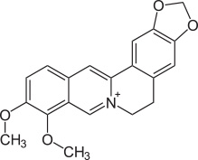
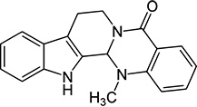

# Metabolomics
This is a project investigating the metabolomic variation induced by drugs.

## Introduction
There are two drugs under the current study， one is alkaloid **berberine**  and the other is **evodiamine** . These two drugs are used to treat human liver cancer cell line **BEL-7402** in single-drug and combination manners. 

In previous work of **[Wang XN et al.](http://www.ncbi.nlm.nih.gov/pubmed/18579357)**, berberine and evodiamine were found to exhibit **synergistic effect** on enhancing the apoptosis of human hepatocellular carcinoma ***SMMC-7721***.

The abstract of that article is quoted below.
> Berberine and evodiamine, two kinds of alkaloids, have been reported to show many activities. In the present paper, inhibitory activities of the two compounds and their mixtures on human hepatocellular carcinoma SMMC-7721 cells were investigated, and the inhibitory rates, apoptosis, cell cycle distribution and tumor necrosis factor-alpha (TNF-alpha) were all tested and described. The results indicate that the mixtures of the two compounds showed the highest inhibition effect (50.00%) as compared with berberine and evodiamine used individually (20.24% and 16.33%, respectively) over 48 h. Through fluorescence microscope and flow cytometry (FCM) analysis, the cell apoptosis and cell cycle distribution of SMMC-7721 induced by the synergy of the two compounds was made evident. Furthermore, the TNF-alpha value in the mixture treated group was much higher (p<0.05) than in the other two groups. Thus, the combined use of berberine and evodiamine could significantly enhance the apoptosis of SMMC-7721 cells, which will be useful to further anti-cancer therapy and research.

## Summary of the data available

